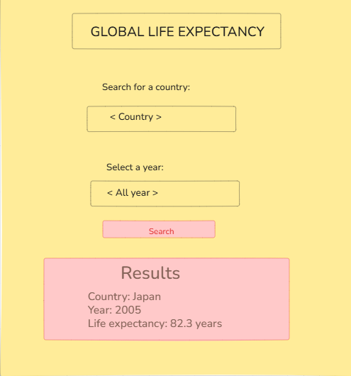

# Global Life Expectancy

## The problem:
 A public health researcher or curious person needs an easy way to find life expectancy data for different countries and years because they want to understand how health and longevity differ around the world. My page will let them search for a country and view its life expectancy data by year.

## The plan

### Sections
  - A visitor sees a place to search for a country and choose a year.
  - A visitor sees the life expectancy information that matches their search.

### User input
  - A visitor types a country and the page shows the life expectancy data for that country.
  - A visitor clicks a year and the page shows the result for that year.

### Outputs
  - Country
  - Year
  - Life expectancy

## Data:

| id | year | country | code | life_expectancy |
|---|---|---|---|---|
| 1 | 1980 | Afghanistan | AFG | 41 |
| 2 | 1981 | Afghanistan | AFG | 42 |

Questions:
1. Which countries have the highest and lowest life expectancy?? 
2. How has life expectancy changed over the years?
3. Which countries have seen the biggest increase in life expectancy?

## Team

Accountability partner: @MiayaDennis

- Live: https://edwardcoded77.github.io/capstone/ 
- Repo: https://github.com/edwardcoded77/capstone
